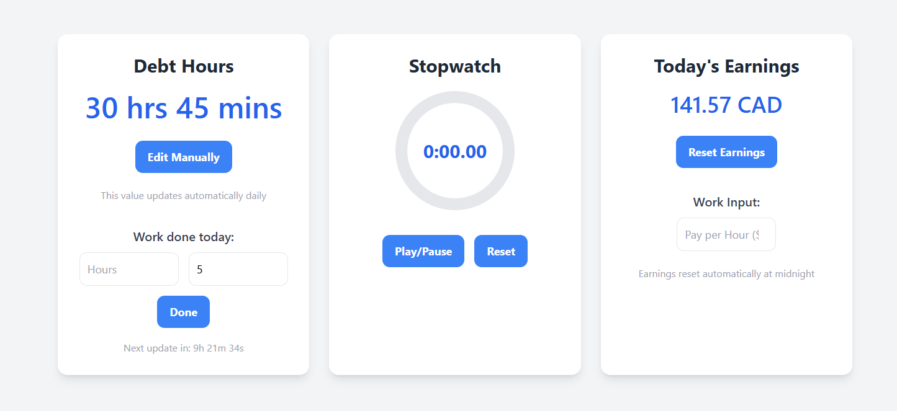

# Hours Tracker

- A website using simple html, javascript, and tailwind to track my working hours.
- To run, simply open in browser, or navigate to <https://wcraske.github.io/hoursTracker/>

# How it works

- When visiting the site, it saves the data persistently using indexedDB. This allows for the data to retain even after refreshes. 
- The site updates the debt hours daily According to my schedule.
- The tab title updates dynamically when using the timer, since this page will frequently be open in the background, and when the timer is not running, it returns to the debt hours.

# Screenshots

